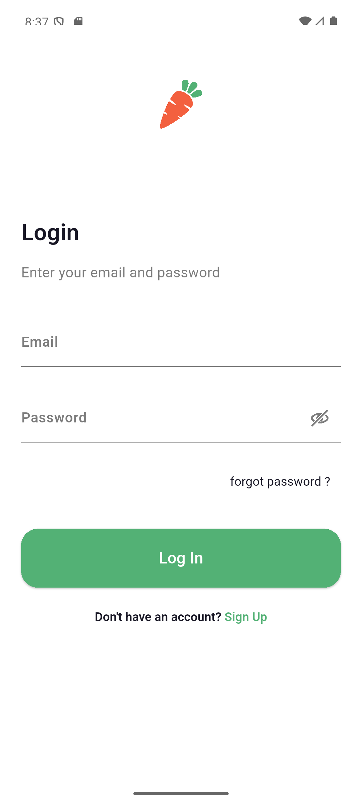
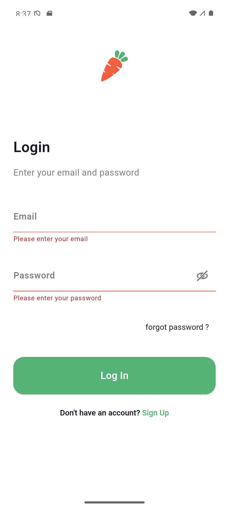
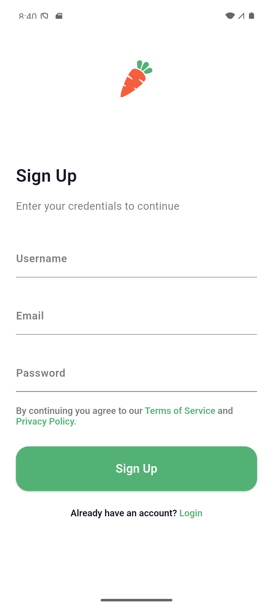
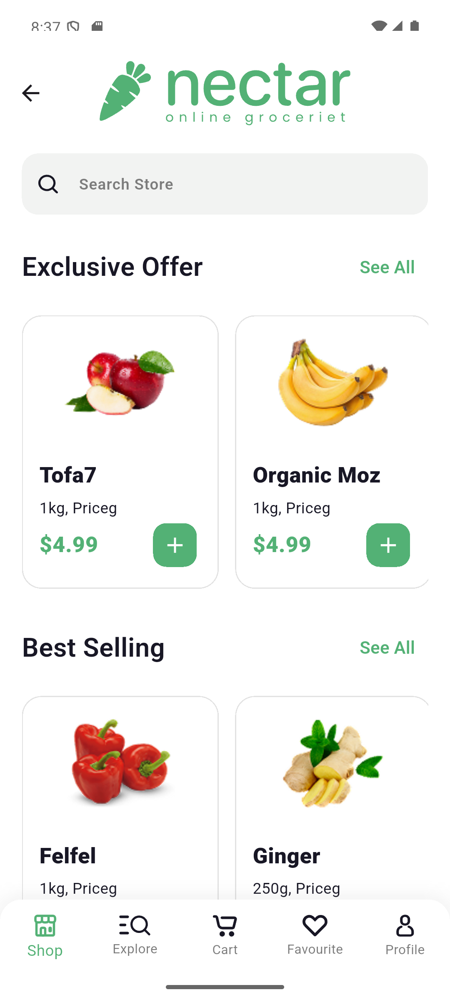
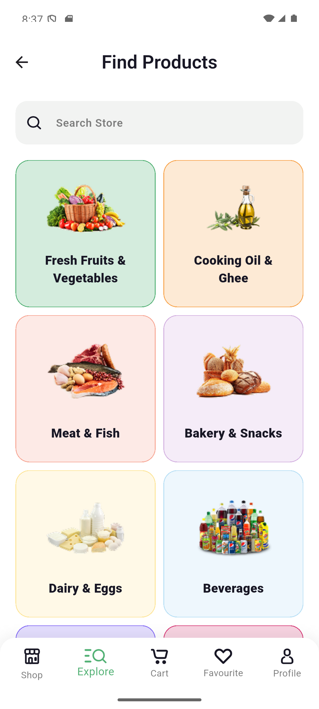
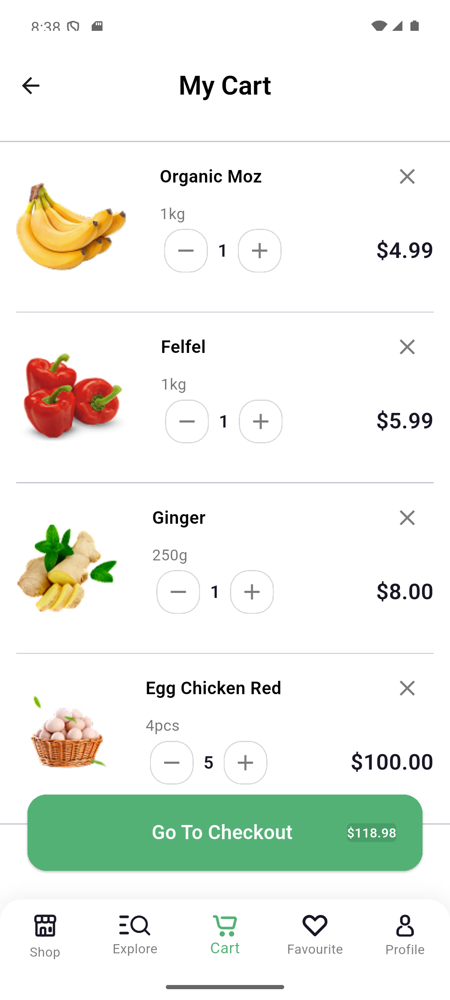
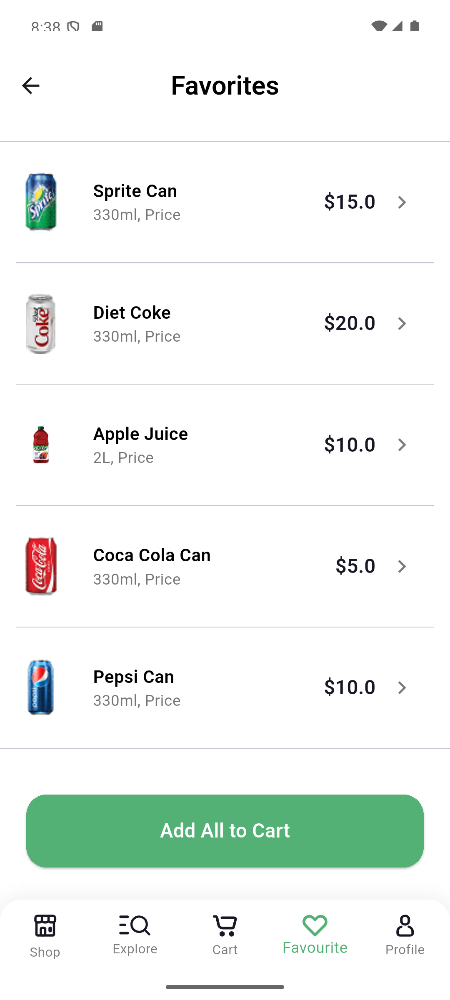
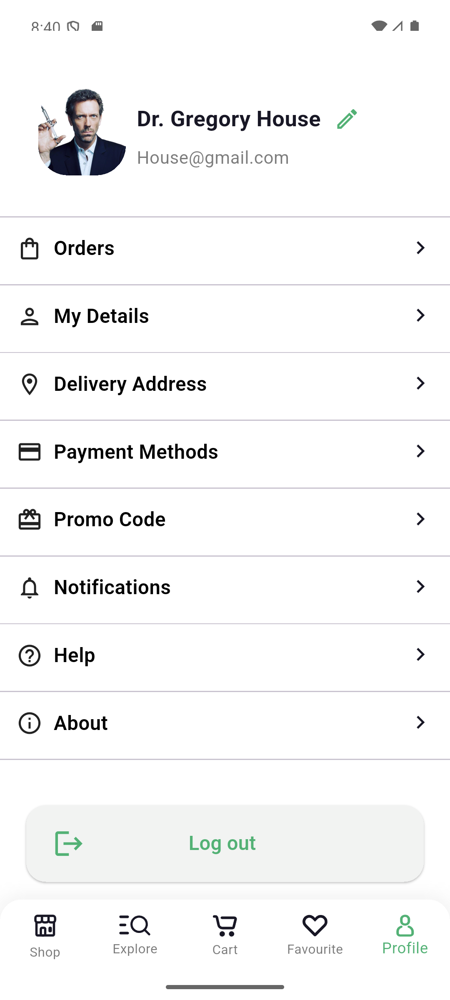

# Nectar - Grocery Shopping App 🛒

A modern and intuitive grocery shopping app built with Flutter, offering a seamless shopping experience with product browsing, cart management, favorites, and user authentication.

## 📱 Screenshots

  
  
  

  
  
  

  
  
  

## ✨ Features

- 🔐 Authentication (login and registration)
- 🏠 Home/shop with featured and best-selling products
- 🔍 Explore by categories
- 🛒 Cart with quantity controls and totals
- ❤️ Favourites
- 👤 Profile
- 📱 Smooth bottom navigation

## 🛠️ Built With

- Flutter (Dart)
- Flutter SVG for icons
- Feature-based folder structure

