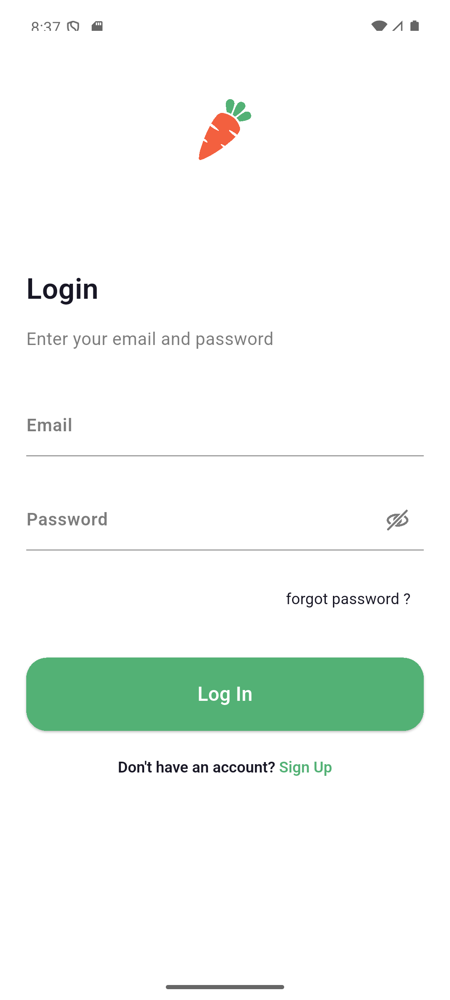
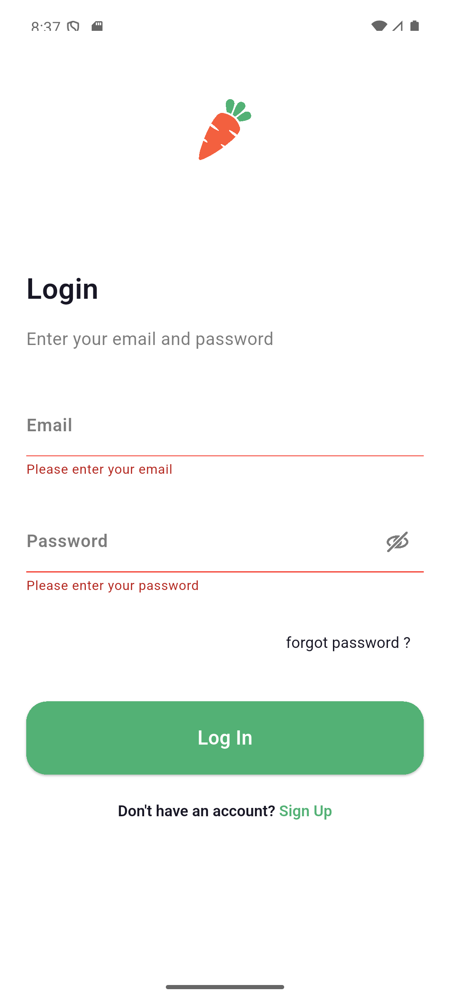
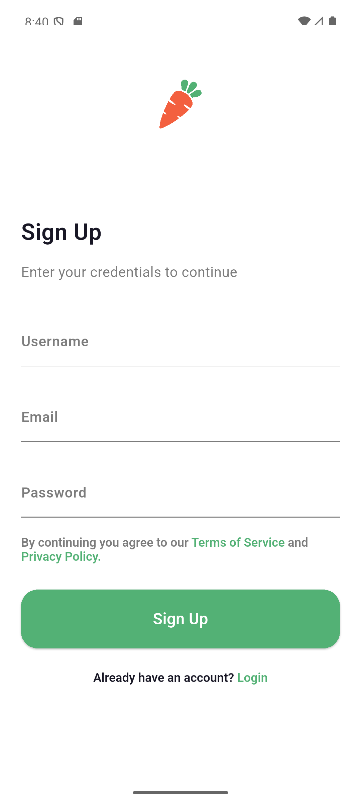
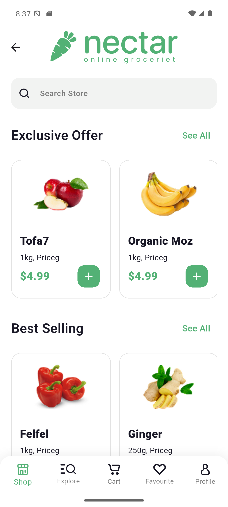
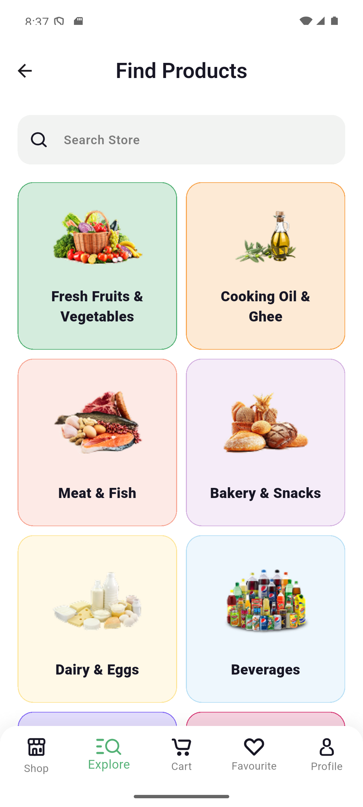
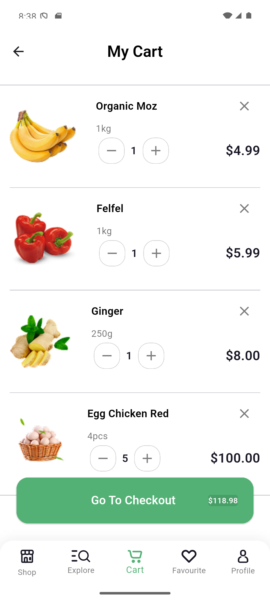
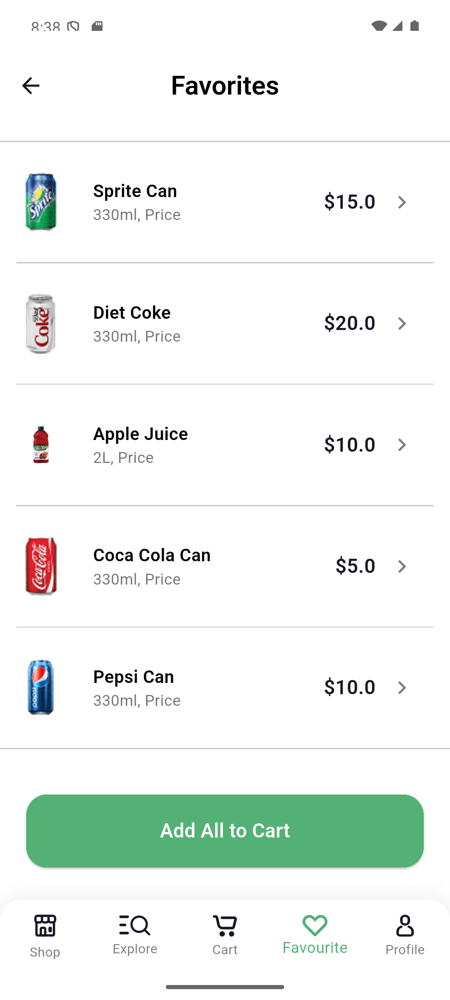
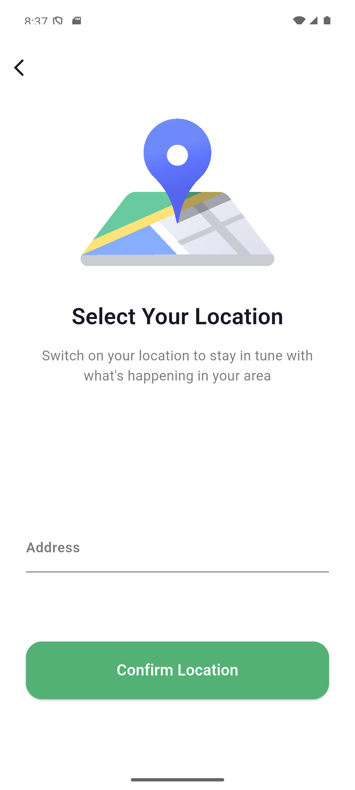
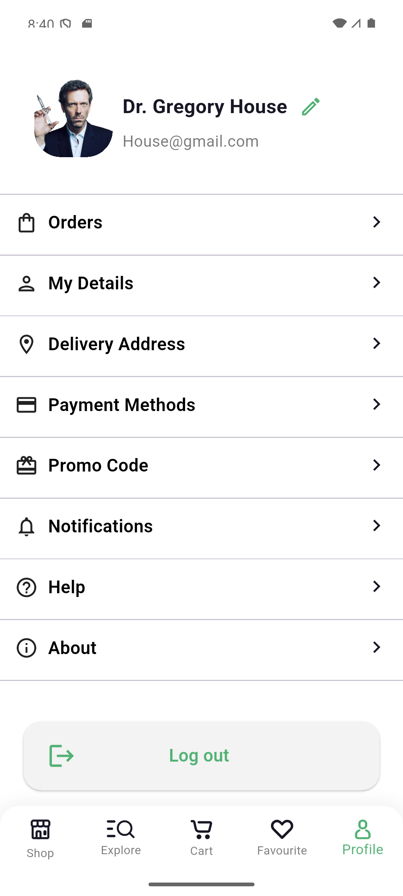

# Nectar - Grocery Shopping App 🛒

A modern and intuitive grocery shopping app built with Flutter. Browse products, manage a cart and favourites, and sign in securely — all with a clean, polished UI.

## 🎬 Demo

<div align="center">
  
</div>

## 📱 Screens & Descriptions

| | | |
|---|---|---|
|  |  |  |
| <sub>Login</sub><br/><sub>Simple, focused sign-in to get users in quickly.</sub> | <sub>Login (Validation)</sub><br/><sub>Field-level validation for clear, actionable errors.</sub> | <sub>Sign Up</sub><br/><sub>Streamlined account creation with minimal friction.</sub> |
|  |  |  |
| <sub>Shop</sub><br/><sub>Curated home with featured and best-sellers.</sub> | <sub>Explore</sub><br/><sub>Category-based discovery and search.</sub> | <sub>Cart</sub><br/><sub>Quantity controls, price summary, and checkout entry.</sub> |
|  |  |  |
| <sub>Favourites</sub><br/><sub>Save and revisit the items you love.</sub> | <sub>Location</sub><br/><sub>Address selection to personalize delivery.</sub> | <sub>Profile</sub><br/><sub>Account details and app settings.</sub> |

## ✨ Highlights

- Smooth bottom navigation with clear state persistence
- Input validation with friendly, inline messages
- Reusable UI components for consistent design
- Feature-first architecture for scalable code

## 📂 Structure (brief)

```
lib/
├─ components/      # Reusable widgets
├─ core/            # Constants, utils, extensions
├─ features/        # auth, cart, explore, favs, home, location, nav_bar, profile, splash
└─ main.dart        # App entry
```
